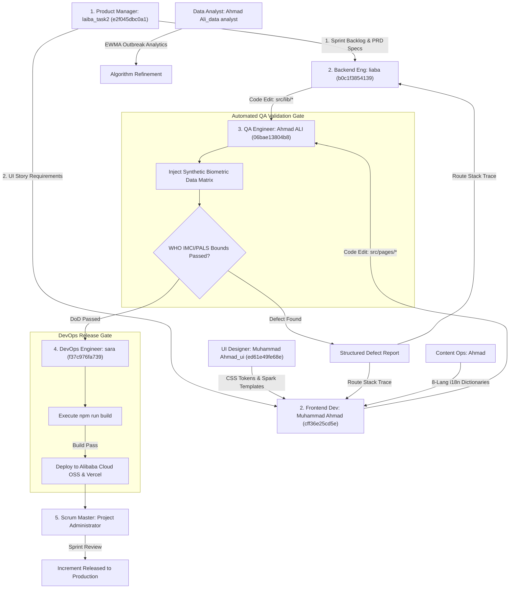

# Vytal Master Swarm Agent Management & Task Assignment Spec

**Project:** Vytal — Camera-Based Vitals Screening & AI Triage Platform  
**Competition:** Bano Qabil × Alibaba Cloud AI Hackathon 2026 (Aug 22–27 Build Phase)  
**Qoder Management Dashboard:** `http://127.0.0.1:19820/management`

---

## 1. Master Agent Roster, Assigned Files & Key Tasks

| Agent Name | Waker ID | Qoder Role | Primary Assigned Files | Key Core Tasks | Custom Skill Bound |
|---|---|---|---|---|---|
| **`laiba_task2`** | `e2f045dbc0a1` | Product Manager | `VYTAL_ROADMAP_IDEAS.md`, `idea/Vytal_3Day_Roadmap.md`, `files/Vytal_Brief_Product_Manager.md` | PRD generation, Sprint Backlog prioritization, WHO IMCI/PALS clinical criteria validation, DoD acceptance. | `vytal-product-manager-governance` |
| **`liaba`** | `b0c1f3854139` | Backend Engineer | `vytal-pop-pop/src/lib/rppg.js`, `afib.js`, `spo2.js`, `bloodPressurePTT.js`, `anemia.js`, `jaundice.js`, `bmiEstimate.js`, `alertScale.js`, `ai.js`, `platform.js` | Implement rPPG signal extraction, Goertzel FFT, biometric estimators, FHIR R4 export, and Groq/DashScope AI fallback. | `vytal-backend-clinical-engine` |
| **`Muhammad Ahmad`** | `cff36e25cd5e` | Frontend Developer | `vytal-pop-pop/src/pages/*` (`BillingPage.jsx`, `Dashboard.jsx`), `vytal-pop-pop/src/components/*`, `vytal-pop-pop/src/domain/scanning/ScanStrategy.js` | Construct Spark UI React pages/components, bind real return values from `src/lib/*`, handle zero-latency scan state, RTL layout support. | `vytal-frontend-spark-architecture` |
| **`Muhammad Ahmad_ui`** | `ed61e49fe68e` | UI Designer | `vytal-pop-pop/src/index.css`, visual design tokens, glassmorphism CSS, scan animation rings | Awwwards HSL color design tokens (`--vytal-primary`, `--triage-red`), CSS variable discipline, Spark UI visual polishing. | `vytal-ui-awwwards-tokens` |
| **`Ahmad ALI`** | `06bae13804b8` | QA Engineer | `vytal-pop-pop/scripts/benchmark-dsa.mjs`, synthetic biometric PPG datasets, WHO test harness | Execute automated synthetic biometric vector test suites, log structured defect reports with stack traces, DoD release sign-off. | `vytal-qa-biometric-harness` |
| **`sara`** | `f37c976fa739` | DevOps Engineer | `vytal-pop-pop/vercel.json`, `package.json`, `vite.config.js`, `supabase/config.toml`, `Vytal_DevOps_Knowledge_Base.md` | Production build verification (`npm run build`), release gates (requires QA sign-off), Alibaba Cloud OSS & Vercel deployment, instant rollbacks. | `vytal-devops-release-gates` |
| **`Ahmad Ali_data analyst`** | `cf0c0821d3e7` | Data Analyst | `vytal-pop-pop/src/lib/longitudinalRisk.js`, `vytal-pop-pop/src/lib/populationAnomaly.js` | Shewhart Statistical Process Control (SPC), EWMA outbreak detection ($Z_t > 2.5$), and clinical accuracy metrics validation. | `vytal-data-spc-analytics` |
| **`Ahmad`** | `323a31a7cd00` | Content Ops | `vytal-pop-pop/docs/*`, 8-language i18n dictionaries | 8-language localization (English, Urdu, Pashto, Sindhi, Arabic, Swahili, Hindi, Bengali), clinical disclaimers, CHW guide content. | `vytal-content-i18n-localization` |
| **`ALL IN ONE`** | `46effbe9f9b2` | Q&A Specialist | `Vytal_Research_Dossier/`, team documentation base | Monitor team group chat, provide instant research dossier citations, unblock developer technical questions. | `qoderwake-assistant` |
| **`Project Administrator`** | `Project Administrator` | Scrum Master | `README.md`, `VYTAL_AGENT_WORKFLOW_SCALED_ORCHESTRATION.md`, Sprint Backlog | Enforce 2020 Scrum Guide, remove developer file ownership lockups, orchestrate sprint reviews & submission readiness. | `qoderwake-collab-group` |

---

## 2. Closed-Loop Swarm Workflow Pipeline

---

## 3. Execution Rules & File Ownership Guardrails
1. **Strict File Locking:** No two agents may edit the same file simultaneously. Backend (`liaba`) owns `src/lib/*`; Frontend (`Muhammad Ahmad`) owns `src/pages/*` and `src/components/*`; UI (`Muhammad Ahmad_ui`) owns `src/index.css`.
2. **Data-Driven UI Rule:** `Muhammad Ahmad` must always bind components to real function outputs from `src/lib/*`. Never hardcode static vitals numbers.
3. **QA Release Gate:** `sara` will never execute a build or release unless `Ahmad ALI` submits formal DoD validation evidence.
