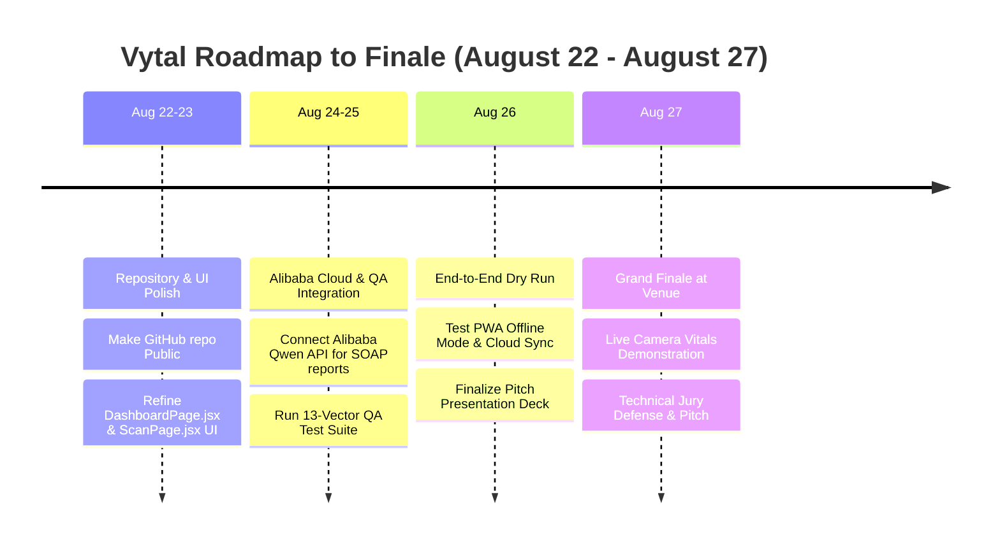

# 🚀 VYTAL MASTER STRATEGIC EXECUTION PLAN
**Bano Qabil × Alibaba Cloud AI Hackathon 2026**
*Project:* **Vytal — Camera-Based Vitals Screening & AI Triage Platform**  
*Team:* **Ahmad Ali & Laiba**  
*Target Date:* **August 27, 2026 (On-Site Grand Finale)**

---

## 1. PROJECT VISION & INITIAL MEETING RECAP

### What is Vytal?
Vytal is a non-invasive, camera-based clinical screening and AI triage platform designed for low-resource and remote healthcare settings. Using a standard smartphone or web camera, Vytal extracts vital biometrics in under 30 seconds:
- **rPPG Heart Rate & Pulse Variability (HRV)**
- **Blood Oxygen Saturation ($SpO_2$) via Ratio-of-Ratios (RoR)**
- **Atrial Fibrillation (AFib) Screening via RMSSD & pNN50**
- **Pulse Wave Analysis (PWA) Hemodynamic Proxies**
- **Non-Invasive Hemoglobin (Anemia) & Scleral Bilirubin (Jaundice) Screening**
- **Morphometric Malnutrition Screening (Camera BMI / MUAC equivalent)**

### Core Clinical Directive
All vital biometrics feed into an offline, deterministic **WHO IMCI & PALS Clinical Rule Engine**. The AI layer (powered by Alibaba Cloud Qwen / Model Studio) is strictly subordinate to clinical rule engines—it generates natural language SOAP reports and medical explanations, but **never** alters triage safety tiers independently.

---

## 2. ALIBABA CLOUD HACKATHON REQUIREMENTS & CONSTRAINTS

### A. Core Technology Requirements
1. **Alibaba Cloud Infrastructure:**
   - **Model Studio / Qwen LLM:** Used for generating multilingual AI SOAP reports and clinical explanations.
   - **Alibaba Cloud OSS (Object Storage Service):** Hosting production Vite static assets and PWA bundles.
   - **Alibaba Cloud FC 3.0 (Function Compute) / ECS:** Serverless backend microservices for API endpoints and FHIR/DHIS2 export pipelines.

2. **Open-Source Repository:**
   - Code repository (`github.com/Ahmad-Ali-Shah/Project-Vytal-` or `Vital`) must be set to **Public** before evaluation.

3. **Methodology:**
   - **Explore-Refine-Produce (ERP)** 3-Phase Workflow pattern (Stoudt et al. 2021).
   - **Event-Condition-Action-Assertion (ECAA)** rule engine for deterministic clinical safety.

### B. Hackathon Restrictions & Safety Constraints
- ❌ **No Placeholders:** All camera scans must perform real-time skin ROI processing with quality gating ($SNR \ge 6.0\text{ dB}$).
- ❌ **LLM Bounds:** AI language models are forbidden from changing clinical triage tiers (GREEN/YELLOW/ORANGE/RED) on their own.
- ⚡ **Offline Resilience:** The PWA must function 100% offline without internet connection; sync to cloud backends occurs asynchronously.

---

## 3. QODER AUTONOMOUS SWARM ARCHITECTURE (SETUP COMPLETED)

We have configured a **9-Agent Autonomous Swarm + Master Router** inside Qoder (`http://127.0.0.1:19820`):

| Agent Name | Waker ID | Specialized Role | Primary Responsibilities |
|---|---|---|---|
| **Product Manager** (`laiba_task2`) | `e2f045dbc0a1` | Product & Governance Lead | WHO IMCI & PALS clinical triage rules, sprint backlog, regulatory compliance. |
| **Backend Engineer** (`liaba`) | `b0c1f3854139` | Clinical Algorithm Engineer | `src/lib/*` algorithms: CHROM/POS rPPG, Goertzel FFT, SpO2 RoR, AFib consensus, PWA BP. |
| **Frontend Architect** (`Muhammad Ahmad`) | `cff36e25cd5e` | React 18 SPA Specialist | WebRTC video stream capture, MediaPipe 478 3D Face Landmarker, camera diagnostics. |
| **UI Designer** (`Muhammad Ahmad_ui`) | `ed61e49fe68e` | Awwwards UI Specialist | Glassmorphic design tokens, WHO 4-tier color palette (GREEN/YELLOW/ORANGE/RED), micro-animations. |
| **QA Engineer** (`Ahmad ALI`) | `06bae13804b8` | Quality Assurance Lead | 13-Vector synthetic biometric test harness, MAE validation, FHIR R4 & DHIS2 schema tests. |
| **DevOps Engineer** (`sara`) | `f37c976fa739` | Infrastructure & CI/CD | Vite compilation, Alibaba Cloud OSS/FC 3.0 deployment, 3-gate release gatekeeper. |
| **Data Analyst** | `cf0c0821d3e7` | Epidemiological SPC Lead | CDC EARS EWMA outbreak anomaly detection ($\lambda=0.2, Z_t>2.5$), PALS ranges, linear risk slopes. |
| **Content Ops** (`Ahmad`) | `323a31a7cd00` | Multilingual & DOIs | 8-language i18n matrix, legal disclaimers, FAIR DOI report generation. |
| **Master Router** (`ALL_IN_ONE`) | `46effbe9f9b2` | Swarm Orchestrator | Stoudt ERP 3-Phase & van der Aalst ECAA closed-loop orchestration across all agents. |

### Technical Foundation Built:
- **`Vytal_Master_Knowledge_Base.md`:** 4,700+ line master knowledge document containing the execution graph, system code, and 26 research items.
- **`Vytal_Algorithm_Research_Registry.md`:** Ground-truth research registry linking all 26 clinical algorithms to peer-reviewed literature (IEEE TBME, Optics Express, Sensors, Circulation).
- **`share_qoder_proxy.js`:** Reverse proxy running on port `19821` sanitizing `Host`, `Origin`, and `Referer` headers to enable remote collaborator tunnel access (`https://nine-eagles-battle.loca.lt`).
- **Automated Triggers & MCPs:** Registered 9 automated triggers matching `tr_[a-z0-9]{8,32}` and GitHub `.mcp.json` drivers across all agents.

---

## 4. KEY TECHNICAL & CLINICAL DECISIONS RESOLVED

1. **4-Tier WHO Triage Palette:**
   - **GREEN:** Non-Urgent (Routine care / Home management).
   - **YELLOW:** Moderate / Semi-Urgent (Facility assessment within 24h).
   - **ORANGE:** Urgent (Immediate clinical evaluation).
   - **RED:** Emergency / Resuscitation (Immediate PALS/IMCI escalation).

2. **Pulse Wave Analysis (PWA) vs PTT:**
   - Single-camera facial rPPG scanning uses **Pulse Wave Analysis (PWA)** for morphological blood pressure proxies.

3. **Malnutrition Screening (Camera BMI vs MUAC):**
   - Adult scans use facial aspect ratio BMI proxy.
   - Pediatric IMCI scans estimate Mid-Upper Arm Circumference (**MUAC < 115 mm** for SAM screening) using reference card scaling.

4. **Interoperability (FHIR R4 & DHIS2):**
   - FHIR exports use `Observation` Vital Signs profile (LOINC codes `8867-4`, `8480-6`, `2708-6`).
   - DHIS2 integrations emit `Tracker Program` payloads for longitudinal patient tracking.

---

## 5. ROADMAP TO AUGUST 27 (HACKATHON FINALE)

### Team Role Distribution
- **Ahmad Ali (Technical Lead):**
  - WebRTC video stream & rPPG signal processing oversight.
  - Alibaba Cloud OSS static hosting & FC 3.0 serverless backend deployment.
  - Qoder proxy server & GitHub repository sync.

- **Laiba (Product & Clinical Lead):**
  - WHO IMCI & PALS clinical triage rule validation.
  - Patient workflow testing & UX validation.
  - Pitch presentation deck & live demonstration storytelling.

---

## 6. WHAT WILL HAPPEN AT THE HACKATHON VENUE (AUG 27)

1. **Live Platform Demonstration:**
   - Demonstrate a live 30-second camera scan on a smartphone/laptop.
   - Show real-time rPPG pulse extraction, $SpO_2$ estimation, AFib detection, and instantaneous WHO 4-tier color triage.
2. **AI SOAP Report Generation:**
   - Showcase multilingual clinical SOAP notes generated automatically by Alibaba Cloud Model Studio (Qwen LLM).
3. **Technical Jury Evaluation:**
   - Defend the system architecture: offline PWA resilience, FHIR R4/DHIS2 export capability, and the 9-agent Qoder autonomous swarm.
