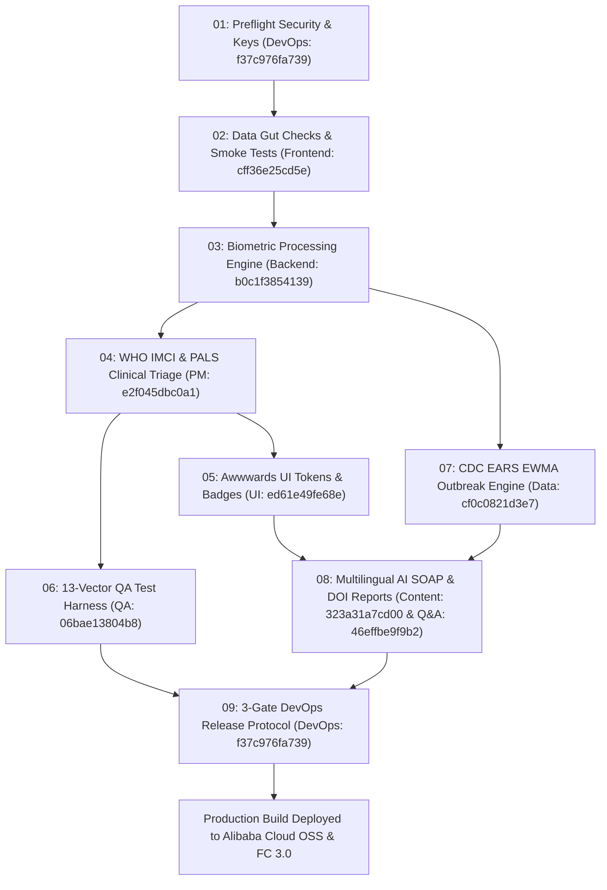

# VYTAL RESEARCH-GRADE MULTI-AGENT SWARM WAKERFLOW SPECIFICATION
# Project: Vytal (Bano Qabil × Alibaba Cloud AI Hackathon 2026)
# Workflow ID: ced7b93e-5469-4dd6-b185-082dfb5c9fb5
# Academic Framework: Stoudt, Vásquez, Martinez 2021 (PLOS Comp Bio / PMC7971542 - Principles for Data Analysis Workflows)
# Process Modeling Rules: Knolmayer, Endl, Pfahrer & van der Aalst 2000 (ECAA Business Rules)
# Best Practices: Equorum 12 Best Practices for Workflow Design

---

## 1. ACADEMIC & ENGINEERING FOUNDATIONS

### A. The 3-Phase ERP Scientific Workflow Paradigm (Stoudt et al. 2021)
1. **Explore Phase (Phase A)**:
   - **Data Gut Checks / Smoke Tests**: Validates temporal RGB frame ranges ($25 \le \text{RGB} \le 250$), tissue saturation floor ($S > 0.08$), frame counts ($N \ge 60$), and ITA° skin tone classification.
   - **Defensive Assertions**: Halts execution early if >30% of frames suffer from clipping, motion jitter, or dark illumination.
2. **Refine Phase (Phase B)**:
   - **Modular Helper Functions**: Abstracts rPPG CHROM/POS, Goertzel HR, AFib 3-vote consensus, conjunctival Hb ($\text{EI} = \frac{R-G}{R+G}$, $\text{Hb} = 4.5 + 0.85 \cdot \text{EI}$), scleral Yellow Index ($\text{YI} \ge 18$), and CDC EARS EWMA outbreak anomaly models.
   - **Consensus & Unit Testing**: Verifies computed signals against the 13 synthetic QA test harness vectors (MAE $\le 8$ BPM, AUC $\ge 0.90$).
3. **Produce Phase (Phase C)**:
   - **FAIR Data Compliance & Executable Compendium**: Generates SHA-256 digital audit hashes and persistent DOI metadata (`10.5281/zenodo.vytal.2026.swarm.01`).
   - **Dual-Tier AI Reporting**: Outputs plain-language caregiver summaries & 8-language clinician SOAP notes with legal disclaimers.
   - **3-Gate DevOps Release Protocol**: Enforces Gate 1 (QA 13-vector sign-off), Gate 2 (Secret Scanner), and Gate 3 (Production build to Alibaba Cloud OSS & FC 3.0).

### B. Equorum 12 Best Practices for Workflow Design
1. **Clear Goal Definition**: Pre-flight assertion of mission parameters.
2. **Strict Input/Output Schema Enforcement**: JSON schema validation at every stage.
3. **Explicit Agent Assignment & Ownership**: Each step bound to exact worker ID & employee name.
4. **Defensive Error Handling & Exception Fallbacks**: Catch block recovery with safe default fallbacks (`FALLBACK_SAFE_TRIAGE`).
5. **Continuous Telemetry & Logging**: Timestamped structured log entries with execution time profiling.
6. **Audit Trails & Provenance Tracking**: SHA-256 state hashing and immutability logs.
7. **Modular Sub-Workflows & Refinement**: Hierarchical ECA rule decomposition.
8. **Real-time Monitoring & Health Checks**: SNR and frame jitter telemetry metrics.
9. **Optimization Loops**: Dynamic algorithm selection (CHROM vs POS based on SNR).
10. **Security & RLS Checks**: Pre-flight verification of Supabase RLS and environment keys.
11. **Versioning & Fallback Locks**: Immutable workflow version tracking.
12. **Quantitative Completion Metrics**: Clear numeric DoD sign-off scores (e.g. 13/13 QA vectors passed).

### C. Event-Condition-Action-Assertion (ECAA) Rule Engine (Knolmayer & van der Aalst 2000)
- **EVENT**: Raw RGB frame sequence arrives from WebRTC interface.
- **CONDITION**: `IF frameCount >= 60 AND validPixelRatio >= 0.70 AND fps IN [15, 120]`
- **ACTION**: Dispatch parallel execution to Backend (`b0c1f3854139`), PM (`e2f045dbc0a1`), UI (`ed61e49fe68e`), QA (`06bae13804b8`), and Data Analyst (`cf0c0821d3e7`).
- **ASSERTION**: `ASSERT hr IN [30, 220] AND qaPassedCount == 13`.

---

## 2. WAKERFLOW EXECUTION GRAPH (9 PHASES)

---

## 3. EXECUTABLE SCRIPT CONTENT (`Vytal_Swarm_WakerFlow_Script.js`)

Copy and paste the code from `Vytal_Swarm_WakerFlow_Script.js` directly into the **`<> Script`** tab of WakerFlow at `http://127.0.0.1:19820/wakerflow/ced7b93e-5469-4dd6-b185-082dfb5c9fb5`.
